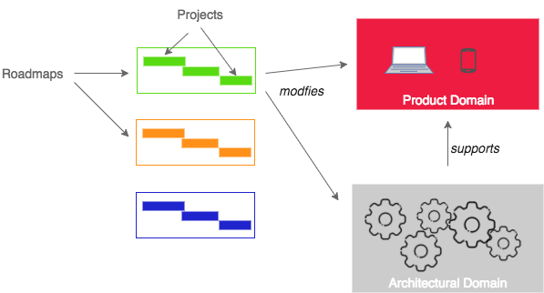

Roles Overview
========================

Depending on the purpose and size and grouping of engineers at Meetup, the following roles may exist.

A [Product Engineering Lead (PEL)](product_engineering_lead.md) is responsible for a *Product & Architectural Domain*. A PEL may assign Team Leads.

A [Team Lead](team_lead.md) is responsible for a problem-solving Team within a Product Domain. A Team Lead is aligned with *Roadmaps* and may assign Project Leads.

[Project Lead](project_lead.md) is responsible for coordinating the delivery of a single *Project* in a Team.

